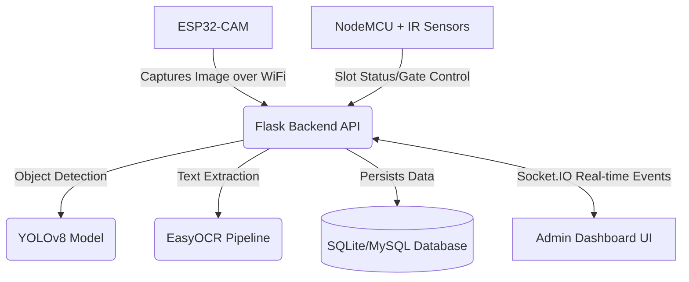

# Enterprise AI Smart Parking System

 <!-- Replace with an actual banner -->

## Project Overview

The **Enterprise AI Smart Parking System** is a full-stack, production-ready IoT and Computer Vision solution designed to automate vehicle entry, allocate parking slots dynamically, and process payments. Leveraging YOLOv8 and PaddleOCR, the system achieves high-accuracy Automatic Number Plate Recognition (ANPR) for Indian license plates, ensuring seamless gate control and real-time dashboard analytics.

## Features

- **Automated License Plate Recognition (ALPR)**: Employs custom YOLOv8 object detection and EasyOCR/PaddleOCR pipeline to extract vehicle plates with high confidence.
- **Dynamic Slot Allocation**: Intelligent algorithm that assigns parking slots based on proximity and priority scores.
- **Hardware Integration**: Real-time communication with ESP32-CAM (for image capture) and NodeMCU (for IR sensor slot tracking and servo gate control) via WebSockets and REST APIs.
- **Real-Time Analytics Dashboard**: Glassmorphism UI built with Vanilla JS, HTML, and CSS, communicating over Socket.IO to visualize system load, revenue, and live logs.
- **Automated Billing & Dynamic Pricing**: Surge pricing models based on parking occupancy, with QR-code payment generation.
- **Robust Security**: API SLA monitoring, error logging, JWT-ready architecture, and SLA/latency tracking.

## Architecture Diagram



## Hardware Requirements

- **ESP32-CAM Module**: For capturing vehicle entry and exit images.
- **NodeMCU (ESP8266/ESP32)**: For processing IR sensor data and controlling gates.
- **IR Sensors (3x)**: For detecting slot occupancy.
- **Servo Motor**: For physical gate barrier simulation.
- **FTDI Programmer** (optional): For flashing firmware to the ESP modules.

## Software Stack

- **Backend**: Python 3.10+, Flask, Flask-SQLAlchemy, Flask-SocketIO, APScheduler
- **AI/ML**: Ultralytics YOLOv8, EasyOCR, OpenCV, Scikit-learn
- **Frontend**: HTML5, CSS3 (Glassmorphism), Vanilla JavaScript, Socket.IO Client
- **Database**: SQLite (Default) / MySQL (Production)
- **Deployment**: Gunicorn, Waitress (Windows), Docker-ready

## Installation Steps

### 1. Clone the Repository

```bash
git clone https://github.com/yourusername/SmartParkingSystem.git
cd SmartParkingSystem
```

### 2. Environment Setup

Create a virtual environment and install dependencies:

```bash
python -m venv venv
source venv/bin/activate  # On Windows: venv\Scripts\activate
pip install -r requirements.txt
```

### 3. Configuration

Duplicate the example environment file and update your variables:

```bash
cp .env.example .env
```

If you have trained a custom YOLO model for Indian license plates, place it in:
`models/anpr/best.pt`
*(Note: Large models are ignored by `.gitignore`. If `best.pt` is not present, the system falls back to `yolov8n.pt`)*

### 4. Running the Flask Backend

Initialize the database and run the server:

```bash
python setup_db.py  # Optional: If you need to manually init
python app.py
```

The server will start on `http://0.0.0.0:5000`.

## Hardware Setup

### ESP32-CAM Setup

1. Open `ESP32/ESP32.ino` in the Arduino IDE.
2. Install the necessary ESP32 board manager URLs.
3. Update `YOUR_WIFI_SSID`, `YOUR_WIFI_PASSWORD`, and `YOUR_SERVER_IP` to match your local network and the IP address of the machine running the Flask server.
4. Compile and upload to the ESP32-CAM module.

### NodeMCU Setup

1. Open `NodeMCU/NodeMCU.ino` in the Arduino IDE.
2. Install the ESP8266 board manager and the `ArduinoJson` and `Servo` libraries.
3. Update `YOUR_WIFI_SSID`, `YOUR_WIFI_PASSWORD`, and `YOUR_SERVER_IP` in the code.
4. Wire the IR sensors to pins D1, D2, and D5, and the Servo to D0.
5. Compile and upload.

## Dashboard Screenshots

### Master Command Center
 <!-- Replace with actual screenshot -->

### Real-Time Live Logs
 <!-- Replace with actual screenshot -->

## Future Improvements

- Migrate to AWS EC2 with RDS for cloud scalability.
- Implement specialized PaddleOCR for localized font reading.
- Implement server-side JWT authentication for multi-tenant management.
- Upgrade to a 5G-enabled edge computing module (like Jetson Nano) for on-device inference.

## License

This project is licensed under the MIT License. See the `LICENSE` file for more details.
